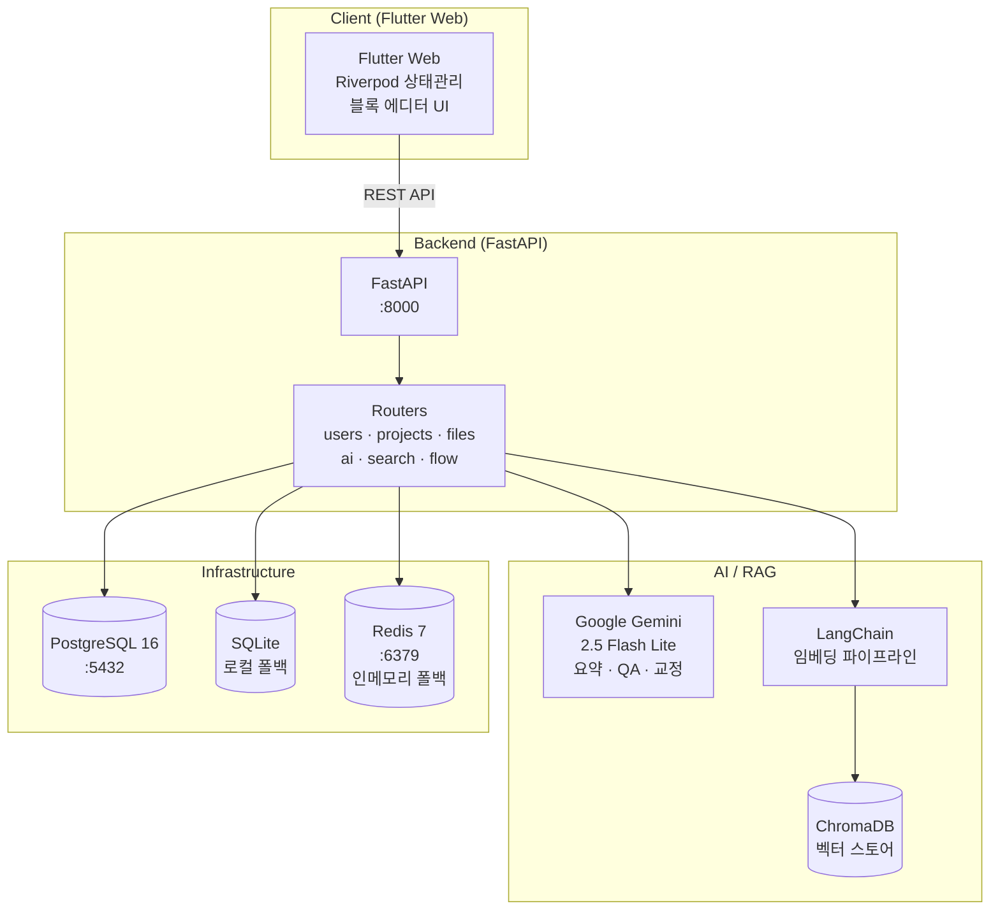

# 📚 StudyFlow

## "흩어진 학습을 하나의 흐름으로" — AI 기반 올인원 학습 노트 플랫폼

Notion 스타일 블록 에디터에 **AI 요약 · RAG 시맨틱 검색 · QA 챗봇 · 마인드맵 시각화**를 결합한 학생 맞춤형 학습 워크스페이스입니다.

학생들이 학습 과정에서 겪는 가장 큰 비효율은 **노트 작성, 자료 검색, AI 활용이 서로 다른 도구로 단절**되어 있다는 점입니다.
StudyFlow는 작성부터 복습까지 전 과정을 하나의 워크스페이스로 통합하여, 학습의 흐름이 끊기지 않도록 돕습니다.


---
## 0. 홍보 영상


---

## 1. 프로젝트 배경과 필요성

학습 자료는 점점 다양해지지만, 학생들의 학습 도구는 여전히 파편화되어 있습니다.

- **도구 단절**: 노트는 노트 앱에, 검색은 포털에, 질문은 AI 챗봇에 — 학습 흐름이 끊긴다
- **빈약한 AI 연동**: 기존 노트 앱은 AI 요약·검색이 미흡하거나 외부 서비스 연동이 복잡하다
- **자료 유형의 한계**: 수식·PDF·이미지 등 다양한 학습 자료를 한 문서에서 통합 관리하기 어렵다
- **복습의 비효율**: 작성한 노트가 단순 저장에 그쳐, 다시 찾고 복습하기가 번거롭다

StudyFlow는 이 문제를 **블록 에디터 + AI 레이어 + RAG 검색**의 단일 플랫폼으로 해결합니다.

---

## 2. 이 프로젝트가 해결하는 것

- **학습 흐름의 연속성**: 작성·검색·질의·복습을 한 화면에서 끊김 없이 처리
- **AI 기반 복습 효율화**: 노트를 자동 요약하고, 노트 맥락 그대로 질문에 답변
- **의미 기반 검색**: 키워드가 정확히 일치하지 않아도 RAG 임베딩으로 관련 노트를 찾아냄
- **자료 통합**: LaTeX 수식·이미지·PDF·표·코드를 하나의 노트에서 표현
- **시각적 정리**: 노트 내용을 마인드맵·관계 그래프로 자동 시각화

---

## 3. 아키텍처



> **배포 구성**: Frontend → **Vercel**, Backend → **Render** (Docker), DB → **Render PostgreSQL (managed)**

---

## 4. 주요 기능

| 기능 | 설명 |
|------|------|
| 📝 **블록 에디터** | 텍스트·제목·표·코드·인용·체크박스 등 Notion 스타일 블록. 슬래시(`/`) 메뉴, 인라인 서식, Undo/Redo |
| 🧮 **LaTeX 수식** | `flutter_math_fork` 기반 블록 수식(`$$`) 및 인라인 수식(`$...$`) 렌더링 |
| 🤖 **AI 요약** | Gemini 기반 자동 요약 (핵심 개념·상세 내용·핵심 정리). 커스텀 프롬프트 + 스트리밍 출력 |
| 💬 **QA 챗봇** | 노트 컨텍스트 기반 질의응답. 채팅 말풍선 UI + 날짜·시간 히스토리 |
| 🔍 **RAG 시맨틱 검색** | ChromaDB + LangChain 임베딩 의미 검색, 키워드 매칭 폴백 |
| 🧠 **마인드맵 / 그래프** | 노트 자동 마인드맵, 파일 관계 그래프, PDF 내보내기 |
| 🖼️ **파일 첨부** | 이미지 드래그앤드롭 / 파일 선택(base64), PDF 첨부. 이미지를 AI 요약 컨텍스트에 반영 |
| ✍️ **글 교정** | 학술·캐주얼·격식 문체별 맞춤법·문법 교정 |

---

## 5. 기술 스택

| 영역 | 기술 | 버전 |
|------|------|------|
| **Frontend** | Flutter Web, Riverpod, flutter_markdown, flutter_math_fork | Flutter 3.x |
| **Backend** | Python, FastAPI, Uvicorn, SQLModel | Python 3.10+, FastAPI 0.115 |
| **AI / LLM** | Google Gemini, LangChain | Gemini 2.5 Flash Lite, LangChain 0.2 |
| **Vector Store** | ChromaDB, sentence-transformers | Chroma 0.5, ST 3.0 |
| **Database** | PostgreSQL / SQLite, Redis | PG 16, Redis 7 |
| **Auth** | Firebase Auth, Google Sign-In | - |
| **Infra** | Docker, Docker Compose | - |
| **CI/CD** | Render (Backend), Vercel (Frontend) | - |

---

## 6. 디렉토리 구조

```
StudyFlow/
├── back/                       # FastAPI 백엔드
│   ├── app/
│   │   ├── main.py             # 앱 엔트리포인트 (lifespan, CORS)
│   │   ├── api/
│   │   │   ├── api.py          # 라우터 통합
│   │   │   └── endpoints/      # users · projects · files · ai · search · flow
│   │   ├── core/               # config · database · redis_cache · vector_store · web_search
│   │   ├── crud/               # DB CRUD 로직
│   │   └── models/             # SQLModel 데이터 모델 (files, flow, projects, users)
│   ├── Dockerfile
│   └── requirements.txt
│
├── front/study_flow/           # Flutter Web 프론트엔드
│   ├── lib/
│   │   ├── features/           # file(에디터) · shell(앱 셸) 등 기능별 모듈
│   │   └── models/             # block_model 등 데이터 모델
│   ├── web/                    # 웹 엔트리포인트
│   ├── vercel.json             # Vercel 배포 설정
│   └── pubspec.yaml
│
├── docker-compose.yml          # 로컬 개발 전체 스택 (backend + PG + Redis + Ollama)
├── render.yaml                 # Render 클라우드 배포 설정
└── LICENSE                     # 독점 라이선스
```

---

## 7. 빠른 시작

### 사전 요구사항
- Flutter SDK 3.x+
- Python 3.10+
- Docker & Docker Compose
- Google Gemini API Key

### 1. 저장소 클론 및 환경 변수 설정

```bash
git clone https://github.com/lshee9008/StudyFlow.git
cd StudyFlow
cp .env.example .env
# .env 에서 GEMINI_API_KEY 입력
```

### 2. Docker 개발 환경 (권장)

```bash
docker compose up -d              # 전체 스택 실행
docker compose up -d backend      # 백엔드만 재시작
docker compose logs -f backend    # 로그 확인
```

| 서비스 | 포트 |
|--------|------|
| FastAPI 백엔드 | `8000` |
| PostgreSQL | `5432` |
| Redis | `6379` |

API 문서: `http://localhost:8000/docs`

### 3. 로컬 개발 (Docker 미사용)

```bash
# Backend
cd back
python -m venv venv && source venv/bin/activate
pip install -r requirements.txt
uvicorn app.main:app --host 0.0.0.0 --port 8000 --reload

# Frontend
cd front/study_flow
flutter pub get
flutter run -d chrome
```

### 4. 웹 빌드

```bash
cd front/study_flow
flutter build web        # 산출물: build/web
```

---

## 8. API 엔드포인트

| 그룹 | Prefix | 설명 |
|------|--------|------|
| Users | `/api/users` | 회원가입 · 로그인 · 인증 |
| Projects | `/api/projects` | 프로젝트(폴더) CRUD |
| Files | `/api/files` | 노트 파일 CRUD · AI 요약 · 글 교정 |
| AI | `/api/ai` | AI 처리 |
| Search | `/api/search` | RAG 시맨틱 / 키워드 검색 |
| Flow | `/api/flow` | 마인드맵 · 관계 그래프 |

헬스 체크: `GET /health`

---

## 9. 환경 변수

| 변수 | 설명 | 필수 |
|------|------|------|
| `GEMINI_API_KEY` | Google Gemini API 키 | Yes |
| `GEMINI_MODEL` | 사용 모델 (기본 `gemini-2.5-flash-lite`) | 기본값 제공 |
| `DATABASE_URL` | PostgreSQL 연결 문자열 (미설정 시 SQLite 폴백) | 기본값 제공 |
| `REDIS_URL` | Redis 연결 문자열 (미설정 시 인메모리 LRU 폴백) | 기본값 제공 |
| `ALLOWED_ORIGINS` | CORS 허용 오리진 (쉼표 구분) | 기본값 `*` |
| `TAVILY_API_KEY` | 웹 검색 API 키 (선택) | No |

자세한 내용은 `.env.example` 파일을 참조하세요.

---

## 10. 배포

| 대상 | 플랫폼 | 설정 |
|------|--------|------|
| **Frontend** | Vercel | `front/study_flow/vercel.json` (`build/web` 정적 호스팅) |
| **Backend** | Render Web Service (Docker) | `render.yaml` — Singapore 리전 |
| **Database** | Render PostgreSQL (managed) | `render.yaml` |

```bash
# 백엔드 Docker 이미지 빌드 & 푸시
docker build -t lshee9008/studyflow-api:latest ./back
docker push lshee9008/studyflow-api:latest
```

---

## 11. 라이선스

본 소프트웨어는 **독점 라이선스(Proprietary — All Rights Reserved)** 하에 보호됩니다.
저작권자의 명시적 서면 허가 없이 복제·배포·수정·상업적 이용·리버스 엔지니어링을 **엄격히 금지**합니다.
자세한 내용은 [LICENSE](LICENSE) 파일을 참고하세요.

문의: `seunghee0243@gmail.com`

---

<div align="center">

**© 2025–2026 StudyFlow Team. All Rights Reserved.**

</div>
